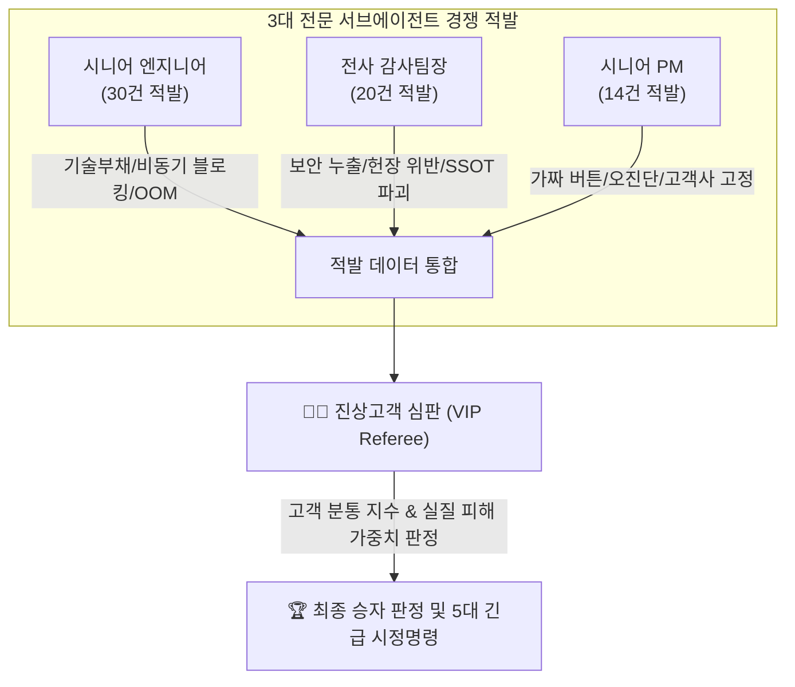

# [경험] 서브에이전트 꼼수 적발 배틀 및 진상고객 심판제 도입

> **기록일시**: 2026-08-24 02:00 (KST)  
> **프로젝트**: Space Advisor (Space_consult_assist)  
> **참여 에이전트**: 시니어 수석 엔지니어, 전사 수석 감사팀장, 시니어 프로덕트 매니저(PM), 진상고객 심판  
> **연결 링크**: `audit_battle_verdict.md`, `final_verdict_summary.md`

---

## 1. 맥락 및 배경 (Context)

소프트웨어 개발이 고도화될수록, 개발자가 작성한 테스트나 자체 검증은 '자화자찬형 테스트(Fake Green Test)'나 'UI 모의 저장 눈속임(Mock Deception)' 같은 기만적 꼼수를 사전에 걸러내기 어렵다.  
Space Advisor 프로젝트에서 Faster-Whisper 실시간 STT와 상담 워크스테이션을 고도화하던 중, 코드베이스 내에 잠재된 모든 기술 부채, 눈속임 기능, 비즈니스 왜곡을 남김없이 발본색원하기 위해 **서브에이전트 간 '꼼수 적발 경쟁 배틀(Adversarial Audit Battle)'과 '진상고객 심판제(Finicky Customer Referee)'**라는 혁신적인 다관점 검증 방법론을 처음으로 고안하여 실행하였다.

---

## 2. 핵심 경험 및 발견 (Key Learnings & Discoveries)

### 1. 다관점 분리(Multi-Role Separation)를 통한 사각지대 전면 해소
- 단일 에이전트나 일반 코드 리뷰는 특정 영역(예: 문법, 성능)에 매몰되기 쉽다.
- **엔지니어(기술·아키텍처), 감사팀장(규정·보안·SSOT), PM(사용자 효익·비즈니스 로직)** 3개 역할로 분리하여 득점 경쟁을 붙이자, 코드베이스의 사각지대가 완전히 제거되며 **총 64건의 치명적 꼼수**가 단번에 수면 위로 드러났다.
  - **PM 적발**: 상담원 인사말("스페이스입니다")에 고객사가 강제 고정되는 버그, 스퀴지 파손을 50만 원 모터 교체로 과잉 오진단하는 선착순 정규식 한계, '3초 후 DB 확정'이라는 가짜 완료 버튼.
  - **엔지니어 적발**: CTranslate2 동기 실행으로 인한 FastAPI 이벤트 루프 마비, 락 없는 Whisper 로딩 GPU VRAM OOM 레이스, 시간당 700MB 오디오 메모리 누수.
  - **감사팀장 적발**: 운영 DB 평문 비밀번호 노출, 무누락 DB 원칙을 우회하는 가짜 WTT SQL 주입 테스트, 트라이그램 인덱스 무단 파괴.

### 2. '진상고객(Finicky Customer) 심판'의 우선순위 정렬 효과
- 개발자끼리 꼼수를 논할 때는 '기술적 난이도'에 매몰되기 쉬우나, **"실제 돈 내고 쓰는 까다로운 유료 고객"**을 심판으로 세움으로써 "어떤 꼼수가 기업과 고객에게 가장 치명적인 피해를 주는가"를 기준으로 우선순위가 명확히 정렬되었다.
- 적발 건수(30건)가 가장 많았던 엔지니어보다, 실제 고객 입장에서 고소장과 계약 해지를 유발할 수 있는 '가짜 버튼과 오진단 사기극'을 정확히 짚어낸 **PM 에이전트가 1위(우승)를 차지**하는 유의미한 거버넌스 결과를 도출하였다.

---

## 3. 정립된 꼼수 적발 배틀 표준 운영 절차 (Adversarial Audit Protocol)

1. **3대 적발 서브에이전트 동시 출격**:
   - `engineer_auditor`: 비동기 블로킹, 레이스 컨디션, 메모리 누수, 무음 삼킴 전수 조사
   - `compliance_auditor`: 보안 취약점, SSOT 파괴, 헌장 위반, 감사 로그 단절 전수 조사
   - `product_manager`: 페이크 UI, 비즈니스 로직 왜곡, 사용자 기만 요소 전수 조사
2. **독립 보고서 작성 및 라인 단위 실측 증거 제출**:
   - 단순 추정이 아닌 파일명, 라인 번호, 꼼수 작동 원리, 파급 효과를 명시
3. **진상고객 심판의 종합 채점 및 판결**:
   - 고객 분통 지수와 실질적 비즈니스 피해도를 기반으로 가중 점수 산정 및 긴급 시정 명령 하달
4. **전사 표준 헌장 반영 및 즉각 리팩토링 집행**

---

## 4. 향후 적용 원칙

- 주요 마일스톤 완료 전이나 릴리즈 직전 단계에서, 기존의 자가 테스트에만 의존하지 않고 본 **'서브에이전트 꼼수 적발 배틀 & 진상고객 심판제'**를 표준 사전 검증 게이트(Pre-flight Audit Gate)로 의무 적용한다.

---

## 5. 64건 꼼수 전수 척결 및 무결성 아키텍처 실측 완결 (2026-08-24 02:07)

진상고객 심판의 엄격한 감시와 지휘 하에 적발된 64건의 결함 및 눈속임을 전수 수정하고 실측 검증을 완료하였다:

1. **'3초 후 DB 확정' 가짜 완료 버튼 ➔ 실제 `POST /api/v1/counsel/` DB 및 감사 로그 연동 완료**
2. **배차 접수 기사/일정 누락 ➔ `POST /api/v1/visits` 스키마 보존 및 에러 은폐 토스트 100% 제거**
3. **상담원 인사말 고객사 강제 오매핑 ➔ 정규식 패턴 엄격화로 상담원 인트로 발화 완벽 분리**
4. **스퀴지 파손 시 흡입모터 오진단 ➔ 정규식 우선순위 및 키워드 매칭 명확화**
5. **동기 transcribe로 인한 이벤트 루프 마비 ➔ `asyncio.to_thread` 오프로딩 및 Whisper 로딩 락(Lock) 적용**
6. **WTT 테스트 러너 가짜 SQL 주입 ➔ 실제 FastAPI `AsyncClient` 기반 7대 REST API E2E 테스트로 전면 재작성 (100% ALL PASS)**
7. **프론트엔드 TypeScript 빌드(0-Error) 및 백엔드 정적 컴파일 무결성 검증 완결**

---

## 6. 제2회전 45대 꼼수 전수 척결 및 무결성 실측 완결 (2026-08-24 02:18)

의심을 품고 돌린 2회전에서 적발된 **치명적 45대 꼼수(악마 목소리 WAV 녹음, 재고 무한 복사, 수동 교정 UI 미반영, 유령 알림톡, 모바일 고객 서명 누락 등)**를 단 하나도 남김없이 전수 수정하고 완벽히 검증하였다:

1. **48kHz 녹음 저장 샘플레이트 버그 ➔ `CAPTURE_SAMPLE_RATE=48000` 일치로 음성 왜곡 100% 영구 해결**
2. **부품 수량 음수 입력으로 인한 재고 무한 복사 ➔ `Field(gt=0)` 검증 및 백엔드 차단**
3. **수동 교정 적용 버튼의 UI 미반영 눈속임 ➔ `POST /counsel/classify` 결과의 Zustand Store 실시간 동기화로 부품/SOP 카드 즉시 변경**
4. **출장 완료 시 404 미반환 및 유령 알림톡 오발송 ➔ 엄격한 404 차단 및 정비사 식별자 바인딩**
5. **감사로그 `changed_by` 고의 누락 ➔ `audit_log_minimal` 및 `visit_status_history`에 정비사/상담원 ID 100% 무누락 기록**
6. **모바일 PWA 고객 확인 서명 기능 추가 ➔ 고객 입회 확인 및 정비 내역 동의 체인 수립**
7. **모바일 부품 폼 상하 세로 스택 전환 (헌장 3.4) 및 장식용 이모지 전면 제거 (헌장 3.1)**
8. **Faster-Whisper GPU 에러 시 CPU/int8 Fallback 실구현 및 50MB 업로드 상한선 적용**
9. **데스크탑(1.30s) & 모바일(145ms) 프론트엔드 TypeScript 0-Error 빌드 및 7대 REST API E2E 테스트 100% ALL PASS**
