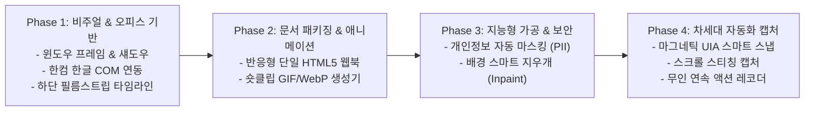

# [계획] 매뉴얼 스튜디오 2세대 (v2.0) 10대 혁신 기능 구현 로드맵

사용자께서 확정 채택해 주신 **아이콘 시안 A(`Ms`)** 배포를 완료하였으며, 채택된 **10대 혁신 기능**을 체계적이고 안정적으로 실현하기 위한 단계별 아키텍처 및 구현 계획입니다.

---

## 1. 한컴 한글(HWP) 내보내기 단축키(F12) 충돌 진단 및 권고안

> [!WARNING]
> **F12 전역(Global) 단축키 등록 시 브라우저 개발자 도구 먹통 위험**
> Windows API(`RegisterHotKey`)로 `F12`를 전역 단축키로 가로채면, Chrome/Edge/Whale 등 브라우저에서 개발자 도구(DevTools)를 열려고 F12를 누를 때 OS 수준에서 키가 차단되어 **브라우저 개발자 모드가 열리지 않고 한글 내보내기가 오발송**됩니다.

### 💡 완벽한 해결 대안 (3-Option Standard)
1. **방안 1 (적극 권장: `Shift + F10`)**:
   - `F10`(PowerPoint)의 패밀리 단축키로서 `Shift + F10`을 한컴 한글(HWP) 직결로 배정.
   - 오피스 문서 도구로서 기억하기 가장 직관적이며 브라우저 단축키와 일절 충돌 없음.
2. **방안 2 (스튜디오 활성화 시 `F12` 로컬 단축키)**:
   - 외부 브라우저 조작 중에는 F12가 정상적으로 브라우저 개발자 도구로 작동.
   - 캡처 후 매뉴얼 스튜디오 창 내부에서 작업 중일 때만 `F12`를 눌러 한글로 직결 전송.
3. **방안 3 (단축키 사용자 정의 커스텀)**:
   - 설정 메뉴에서 사용자가 원하는 단축키를 자유롭게 선택 지정.

---

## 2. 10대 혁신 기능 단계별 구현 로드맵 (4-Phase Architecture)

전체 10개 기능을 안정성 및 실무 효익 순서에 따라 4단계로 나누어 순차적으로 완성합니다.

---

### 🚀 Phase 1: 즉각적인 비주얼 혁신 및 오피스 확장 (1차 착수 대상)
1. **모던 윈도우 프레임 & 소프트 섀도우 (기본값 ON, 끄기 토글 지원)**
   - Notion/Apple 스타일 라운드 코너(12px) + 드롭 섀도우(반경 24px, 투명도 35%) + 상단 3색 신호등 버튼(🔴🟡🟢) 프레임 합성 엔진 구축.
   - 툴바에 `[액자 프레임]` 토글 버튼 배치.
2. **한컴 한글(HWP / HWPX) COM 직결 내보내기 (`Shift+F10` & 스튜디오 내 `F12`)**
   - Windows COM Dispatch (`HWPFrame.HwpObject`) 연동.
   - 현재 열려 있는 한글 문서의 커서 위치에 표 1셀 생성 및 규격화된 이미지 중앙 정렬 자동 삽입.
3. **하단 타임라인 필름스트립 (Filmstrip Storyboard)**
   - 스튜디오 하단에 가로 스크롤 가능한 썸네일 독(Dock) 배치.
   - 캡처 시마다 스텝이 자동으로 누적되며, 썸네일 클릭 시 해당 스텝으로 즉시 전환/재편집 가능.

---

### 📦 Phase 2: 웹북 매뉴얼 & 숏클립 생성기
4. **반응형 단일 파일 웹북 매뉴얼 출력 (Self-Contained Web Manual)**
   - 외부 CDN이나 인터넷 없이 독립 실행되는 싱글 `.html` 파일 생성.
   - 좌측 목차(TOC) + 실시간 검색창 + 고화질 라이트박스 뷰어 + 다크/라이트 테마 내장.
5. **숏클립 튜토리얼 생성기 (Animated GIF / WebP)**
   - 필름스트립에 누적된 스텝들을 1.5초 간격으로 전환되는 초경량 애니메이션 파일로 1클릭 변환.

---

### 🛡️ Phase 3: 보안 마스킹 & 인텔리전트 클린업
6. **개인정보 및 민감 데이터 자동 마스킹 (Auto PII Redaction)**
   - Tesseract OCR / 정규식 엔진으로 전화번호, 주민번호, 계좌번호, 이메일 자동 탐색 후 원클릭 모자이크 적용.
7. **배경 클린업 스마트 지우개 (Content-Aware Eraser)**
   - 선택 영역의 주변 픽셀(Palette & Texture)을 분석하여 배경과 매끄럽게 합성해 불필요한 UI 요소를 지우는 인페인팅 엔진.

---

### ⚡ Phase 4: 차세대 캡처 자동화 (Scribe/Tango 급)
8. **UI 요소 마그네틱 스마트 스냅 (UI Element Snap)**
   - Windows UI Automation (UIA) 기반으로 마우스 호버 컨트롤의 경계 사각형을 자동 추출하여 자석 스냅.
9. **웹/테이블 전용 스크롤 스티칭 캡처 (Panoramic Scroll Stitching)**
   - 스크롤 이동 간 프레임 차분(Difference) 및 템플릿 매칭으로 긴 대장을 1장의 초고해상도 이미지로 스티칭.
10. **무인 연속 액션 레코더 (Action Auto-Recorder)**
    - 전역 마우스/키보드 훅을 통해 클릭 이벤트 발생 시 화면 캡처 + 클릭 좌표에 스탬프/박스 자동 부착 파이프라인.

---

## 3. 검증 계획 (Verification Plan)

- **Phase 1 검증**:
  - `python -m pytest test_manual_studio.py` (기존 56개 단위 테스트 무결성 유지)
  - 윈도우 프레임 섀도우 렌더링 품질 및 투명 알파 마스크 검증
  - 한글 2020/2024 COM 객체 호출 및 표 삽입 동작 검증
  - 하단 필름스트립 스텝 추가/전환/삭제 인터랙션 검증
