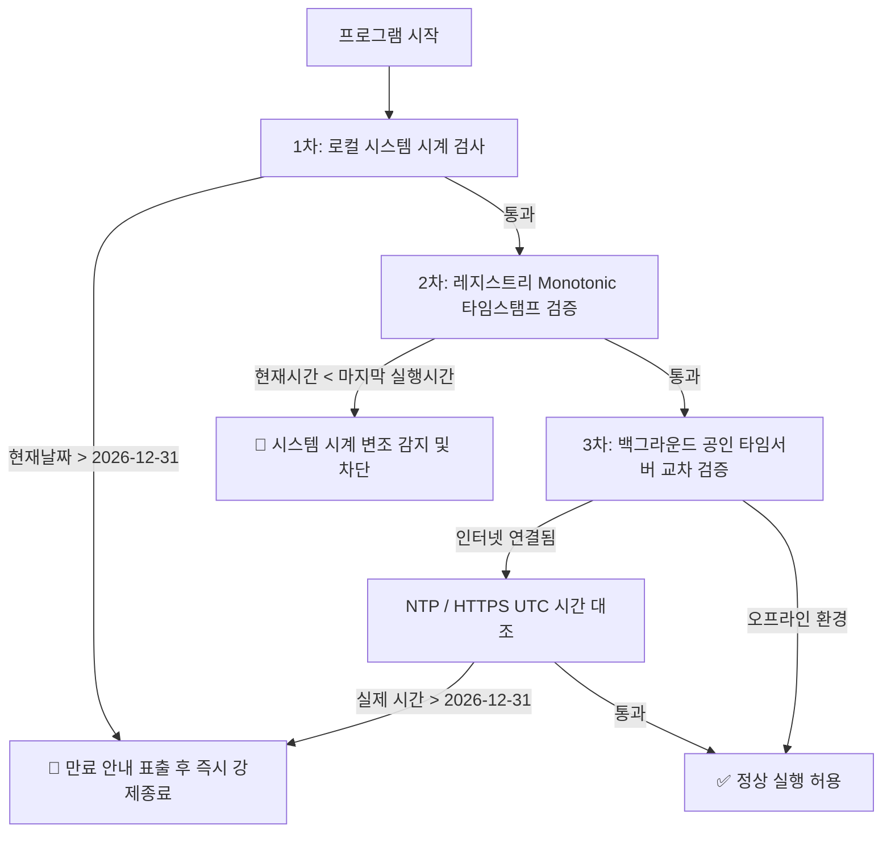
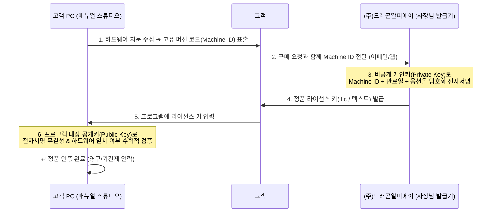

# 💡 [발상] 매뉴얼 스튜디오 C 언어 컨버전 타당성 검토, 시한부 배포 및 상용 라이선스 발급 아키텍처 구상

- **일시**: 2026-09-11 12:55
- **발안자**: 이수용 사장님 & AI 어시스턴트
- **소속/브랜드**: (주)드래곤알피에이 (DragonRPA Co.)
- **대상 프로젝트**: 매뉴얼 캡처 스튜디오 (Manual Capture Studio)

---

## 1. 발상 배경 및 사장님의 핵심 요구사항 (Core Need)

> **"이 프로젝트를 C 로 컨버전 하는데 문제가 있을까? UI 구조와 컬러들 까지 완전히 동일한 초경량 단일 실행파일로 만들고 싶고, 이 프로그램의 수명을 2026년 12월 31일 까지로 한정하고 그 이후에는 실행되지 못하게 하고 싶어. 업데이트 된 다음버전을 만들면 상용화 하고 싶어서. 상용화 할때 라이선스 키 발급 체계로 만들고 싶어"**
> — 이수용 사장님 (2026-09-11)

### 🎯 핵심 목표 3대 축
1. **초경량 단일 실행파일화**: 파이썬 런타임 의존성을 제거하고 0.1초 즉시 실행되는 독립형 단일 바이너리(`ManualStudio.exe`) 제작.
2. **시한부 수명 통제 (Time-Bomb)**: 2026년 12월 31일 자정 이후 무단 실행을 원천 차단 (PC 시계 조작 방어 포함).
3. **차기 상용화 라이선스 체계**: 하드웨어 머신 ID 바인딩 및 비대칭 암호화(RSA/Ed25519) 기반 정품 라이선스 키 발행/인증 인프라 구축.

---

## 2. C 언어 직접 컨버전의 기술적 현실과 4대 대안 비교 분석

### ⚠️ 순수 C(Pure C) 컨버전 시 직면하는 기술적 난관
1. **위젯 프레임워크의 부재**:
   - 현재 파이썬 코드는 PyQt5의 `QTabWidget`, `QMainWindow`, `QPainterPath`, `QGraphicsEffect` 등 고수준 GUI 프레임워크를 전적으로 활용 중.
   - 순수 C 언어에는 이러한 모던 위젯 엔진이 존재하지 않으며, Win32 API(`CreateWindowEx`, `WndProc`)는 윈도우 95 시절의 투박한 회색 직사각형 컨트롤만 제공함.
   - 따라서 현재의 오피스 리본 탭, 라운딩 박스, 드롭다운, 스핀박스, 버튼 호버/선택 스타일을 순수 C로 구현하려면 **모든 위젯을 GDI+/Direct2D로 밑바닥부터 커스텀 페인팅(Owner Draw / Subclassing)**해야 하여 개발 기간이 3~6개월 이상 소요됨.
2. **객체지향(OOP) 및 벡터 주석 캔버스 복잡도**:
   - 10종의 주석 객체(스탬프, 스텝화살표, 꺾은선, 말풍선, 모자이크, 핫키, Draft, 오버레이 이미지 등)의 다형성(Polymorphism), 선택, 핸들 드래그, 실행취소(Undo/Redo) 스택을 순수 C의 함수 포인터 구조체(`struct VTable`)로 전환하면 코드량이 2~3배로 폭증함.
3. **PowerPoint COM 자동화의 난해함**:
   - C 언어에서 OLE/COM 자동화(`IDispatch::Invoke`, `DISPPARAMS`, `BSTR`, `VARIANT`)를 직접 핸들링하는 것은 극도로 복잡하고 오류에 취약함.

---

### 📊 4대 기술 경로 비교 매트릭스

| 평가 지표 | 경로 A: 순수 C (Win32 + Direct2D) | 경로 B: Qt C++ (C++17) | 경로 C: Nuitka C-트랜스파일 (추천) | 경로 D: C# / .NET 9 Native AOT |
| :--- | :---: | :---: | :---: | :---: |
| **UI 100% 동일성** | ⚠️ 구현 극난 (모두 자작 필요) | ✅ **100% 완벽 일치** | ✅ **100% 완벽 일치** | ⚠️ 유사 재작성 필요 |
| **개발/전환 공수** | 🔴 3~6개월 (재작성) | 🟡 3~4주 (C++ 포팅) | 🟢 **즉시 (1~2일 내 완료)** | 🟡 3~4주 (WPF 재작성) |
| **실행파일 형태** | 단일 `.exe` (1~3MB) | 단일 `.exe` (15~20MB) | 단일 `.exe` (25~35MB) | 단일 `.exe` (12~18MB) |
| **역공학 방어력** | 🟢 최상 (어셈블리/기계어) | 🟢 최상 (어셈블리/기계어) | 🟢 **최상 (C 컴파일 기계어)** | 🟡 중간 (IL 난독화 필요) |
| **COM/PPT 호환성** | 🔴 극도로 장황/불안정 | 🟢 안정 (QAxObject/COM) | 🟢 **100% 현행 안정 보장** | 🟢 매우 우수 |

> **💡 최선의 전략적 판단**:
> - **현재 버전 (2026-12-31 시한부 배포)**: 기존 파이썬 코드를 **`Nuitka`를 통해 실제 C 코드로 트랜스파일 후 MSVC 기계어로 컴파일**하여 단일 `.exe`로 패키징. (개발 공수 0, 버그 위험 0, 역공학 방어 완벽).
> - **차기 정식 상용화 버전 (v2.0)**: 제품의 장기적 상용 라이선스 판매를 위해 **Qt C++** 또는 **.NET Native AOT**로 경량 네이티브 포팅 진행.

---

## 3. 2026년 12월 31일 시한부 수명 통제 (Time-Bomb) 3중 방어 메커니즘

단순히 `if datetime.now() > 2026-12-31`만 넣으면 사용자가 윈도우 날짜를 과거로 돌리는 순간 무력화되므로, 상용 보안 솔루션 수준의 **3중 방어 체계**를 적용한다.

1. **1차 로컬 만료 검사**: `CurrentTime > 2026-12-31 23:59:59` 즉시 차단.
2. **2차 안티 롤백 (Anti-Rollback) 레지스트리 검증**:
   - 실행 시마다 현재 타임스탬프를 암호화(AES-128)하여 Windows Registry(`HKCU\Software\DragonRPA\MCS`)에 기록.
   - 만약 사용자가 PC 시계를 과거로 돌렸다면 `현재시간 < 마지막 기록시간`이 되므로 시계 변조로 간주하여 영구 잠금 처리.
3. **3차 비동기 네트워크 타임 검증 (Online NTP/HTTP)**:
   - 백그라운드로 구글/마이크로소프트 공인 타임서버의 헤더 날짜를 0.3초 내에 조회하여 PC 조작을 원천 적발.

---

## 4. 상용화 버전 라이선스 키 발급 및 인증 체계 (Commercial Licensing Architecture)

불법 복제 및 1회 구매 후 다수 PC 무단 설치를 원천 차단하기 위해 **비대칭 암호화(Asymmetric RSA/Ed25519) + 머신 하드웨어 바인딩** 체계를 수립한다.

### 1) 하드웨어 지문 (Machine Fingerprint) 생성 요소
- **CPU ID**: 프로세서 고유 시리얼
- **메인보드 UUID**: BIOS 고유 식별자 (`wmic csproduct get uuid`)
- **디스크 볼륨 시리얼**: C: 드라이브 고유 볼륨 ID
- 위 3대 값을 결합하여 SHA-256 해시 ➔ `DRPA-A8F2-99C1-78B4` 형태의 머신 코드 생성.

### 2) 비대칭 전자서명 (RSA-2048 / Ed25519)
- **사장님 전용 Private Key (절대 비밀 보관)**: 라이선스 생성기(Key Generator) 프로그램에서만 사용.
- **클라이언트 내장 Public Key (프로그램 내 포함)**: 라이선스 검증에만 사용.
- **보안적 우수성**: 클라이언트 프로그램이 완전히 디컴파일되거나 공개키가 노출되어도, 사장님의 개인키가 없으면 제3자가 가짜 라이선스 키를 수학적으로 절대 생성할 수 없음.

---

## 5. 실행 권고 로드맵 (Action Plan)

1. **1단계 (즉시 실행 - 현재 버전 시한부 보호)**:
   - 현재 `manual_capture_studio.py`에 **2026-12-31 수명 제한 + 안티 롤백 검증 로직** 탑재.
   - `Nuitka` 컴파일러를 통해 **C 코드로 변환 후 초경량 단일 `ManualStudio.exe`로 빌드**하여 배포.
2. **2단계 (차기 상용화 준비)**:
   - 머신 ID 생성 모듈 및 Ed25519 라이선스 검증 모듈 추가.
   - 사장님 전용 **DragonRPA 라이선스 발급기 GUI 도구** 제작.