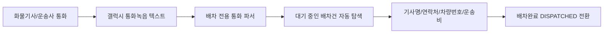

# 배차 담당자 화물 기사 통화요약 연동 기사배정 및 운송비 자동입력

- **일시**: 2026-09-04 15:55
- **작성자**: 사장님 발상 감지 (Antigravity 시스템 자동 기록)
- **맥락**: 영업사원의 출고의뢰에 이어, 배차 담당자가 운송사/화물 기사와 나누는 배차 협의 통화 텍스트(차량번호, 기사 연락처, 확정 운송비 등)를 요약 파싱하여 배차 대장에 즉시 반영하는 확장 구상.

---

## 1. 발상 배경 및 배차 업무의 페인포인트(Pain Point)
- **배차 실무의 현실**: 배차 담당자는 하루에도 수십 통씩 화물 운송사나 개별 지입 기사와 전화 통화를 진행함.
- **통화 내용의 핵심 요소**:
  - *"내일 아침 용인에서 판교 가는 5톤 축차, 경기88바1234 이기사 010-9876-5432로 배차 넣을게요. 운송료는 12만원 맞춰주세요."*
- **기존 불편**: 운전 중이거나 이동 중에 통화한 차량번호, 기사 핸드폰 번호, 협의 운송료를 수첩이나 포스트잇에 메모해 두었다가, 사무실로 돌아와 ERP 배차 화면에서 해당 출고건을 찾아 일일이 타자로 입력해야 함.
- **발상 핵심**: 통화 종료 후 통화 녹음 텍스트를 파싱하여, 배차 대기 중인 대상 건을 자동 매칭하고 **[기사명, 기사연락처, 차량번호, 차종, 확정운송비, 상하차시간]**을 1초 만에 자동 기입하여 `DISPATCHED(배차완료)`로 직결 처리.

---

## 2. 배차 통화 텍스트 파싱 파이프라인 설계

### 추출 대상 핵심 필드
1. **차량 번호 (`vehicleNo`)**: `경기88바1234`, `서울90사5678`, `12가3456` 등 자동차등록번호 정규식.
2. **기사 연락처 (`driverContact`)**: `010-XXXX-XXXX` 휴대전화번호.
3. **기사명 (`driverName`)**: *"이기사"*, *"김철수 기사님"* 등 성함 및 호칭.
4. **차종 (`vehicleType`)**: *"5톤 축차"*, *"3.5톤 광폭"*, *"1톤 카고"*, *"윙바디"* 등 화물 제원.
5. **확정 운송비 (`deliveryCostConfirmed` / `finalCost`)**: *"12만원"*, *"15만"*, *"130,000원"* 등 한글/숫자 금액.
6. **대상 배차건 매칭**: 통화 속 현장명(*"판교"*, *"평택"*) 또는 상하차지 기준으로 현재 `REQUESTED` 상태인 출고의뢰 건과 1:1 자동 연결.

---

## 3. 기대 효익 (헌장 1.1 준수)
- **메모 및 타자 입력 100% 제거**: 통화 종료 후 클릭 1번에 기사 배정, 운송비 확정, 배차 상태 전환 완료.
- **월말 운송료 대사(헌장 카테고리 III 유형 B) 무결성 확보**: 통화 당시 구두 협의된 운송료가 즉시 DB에 저장되므로, 월말 운송사 청구액과의 대사 차액 발생을 사전에 방지.

---

## 🔗 연결 링크
- 상위 발상: [2026-09_갤럭시_통화녹음_텍스트_연동_출고의뢰_자동생성.md](2026-09_갤럭시_통화녹음_텍스트_연동_출고의뢰_자동생성.md)
- 연계 메뉴: `src/pages/TruckDispatch.tsx`, `src/mobile/pages/MobileDispatchList.tsx`
---

## 4. [고도화 발상: 2026-09-05] 음성입력 스키마 가이드 & 실시간 슬롯 하이라이트/누락식별 HUD

### 4.1 발상 배경 및 사용자 경험(UX) 혁신 구상
- **문제의식**: 사용자는 화물 기사와 통화할 때 "어떤 형식으로 말해야 시스템이 알아듣는지", "어떤 항목이 빠졌는지" 알 수 없어 음성 입력을 주저하거나 필수 정보를 누락하는 한계가 존재함.
- **해결 아이디어**:
  1. **음성입력 형식 예시 가이드 제공**: 한 번에 일괄로 말하는 '풀스펙 예시'와 통화 중 조각조각 말하는 '단문 조각 예시'를 화면 상단에 탭/칩 형태로 상시 노출.
  2. **실시간 슬롯 채움(Slot-Filling) 시각화 및 하이라이트**: 음성/텍스트 파싱으로 추출된 정보는 🟢 녹색 테두리 및 체크마크로 즉시 점등(Pulse 효과).
  3. **미완성/누락 필수 항목 실시간 식별**: 아직 비어있는 슬롯은 🔴 오렌지/레드 점선 및 경고 뱃지로 강조하여 사용자가 통화 중에 기사에게 무엇을 더 물어봐야 하는지 직관적으로 가이드.

---

## 5. 차세대 배차할당 4대 고도화 아키텍처 (Advanced Architecture)

### 5.1 배차할당 6대 완결 슬롯 스키마 (6-Slot Schema)
| 슬롯명 | 필드명 | 추출 정규식 / 매핑 규칙 | 필수 여부 |
|--------|--------|------------------------|-----------|
| **1. 대상배차** | `targetDeliveryId` | 현장명, 목적지 주소, 또는 미배차 1순위 | 🚨 필수 |
| **2. 차량번호** | `vehicleNo` | `([가-힣]{2})?\s*(\d{2,3})\s*([가-힣])\s*(\d{4})` | 🚨 필수 |
| **3. 기사명** | `driverName` | `([가-힣]{2,4})\s*(기사님?|사장님?)` | 🚨 필수 |
| **4. 기사연락처** | `driverContact` | `010[-.\s]?\d{3,4}[-.\s]?\d{4}` | 🚨 필수 |
| **5. 확정운송비** | `finalCost` | `(\d{1,3})\s*만(?:\s*원)?` / `(\d{1,3}(?:,\d{3})+)\s*원` | 🚨 필수 |
| **6. 차종/제원** | `vehicleType` | `(5톤\s*축차|5톤|3\.5톤\s*광폭|1톤\s*카고|셀프로더 등)` | ⚙️ 권장 |
| **+ 상하차시간** | `loading/unloadingTime` | `(상차|하차)?\s*(새벽|아침|오전|오후)?\s*(\d{1,2})시` | 📝 부가 |

### 5.2 듀얼 발화 패턴 예시 텔레프롬프터 (Visual Voice Prompt)
- **모드 A: 일괄 완결형 (One-shot Full)**:
  > *"판교 현장 경기88바1234 김철수 기사님 공일공 일이삼사 오육칠팔 5톤 축차 12만원 아침 8시 하차"*
  - 한 문장 발화 시 6대 슬롯이 동시에 100% 🟢 녹색으로 점등되며 배차 승인 준비 완료.
- **모드 B: 조각 증분형 (Fragmented Chunk-by-Chunk)**:
  - 조각 1: *"88바1234 김철수 기사"* ➔ [차량번호], [기사명] 점등
  - 조각 2: *"전화번호 010-1234-5678"* ➔ [기사연락처] 점등
  - 조각 3: *"운송료 13만원 맞춰줘요"* ➔ [확정운송비] 점등
  - 터치 시 발화 텍스트가 즉시 시뮬레이션 주입되는 대화형 칩(Chip) 제공.

### 5.3 기사/운송사 마스터 DB 연동 역추적 자동 완성 (Auto-Hydration)
- 시스템에 기등록된 `transportDrivers`(기사 DB)와 연동:
  - 사용자가 **차량번호(예: 88바1234) 단 1개만 말해도**, 마스터 DB를 역추적하여 **[기사명, 연락처, 차종, 소속운송사]를 1초 만에 100% 자동 채움(Auto-hydrate)**.
  - 임직원의 입력 조작을 4분의 1로 단축하는 전사 헌장 1.1(최우선 사명) 구현.

### 5.4 스마트 역질문 텔레프롬프터 (Agentic Question Guide)
- 슬롯이 비어있을 때 배차 담당자가 통화 중 즉시 읽을 수 있는 추천 멘트를 동적 표출:
  - 📞 [기사연락처] 미입력 시 ➔ *"기사님 배차 문자 보낼 휴대폰 번호 하나만 불러주세요."*
  - 💰 [확정운송비] 미입력 시 ➔ *"사장님 운송료는 얼마로 맞춰드릴까요?"*
  - ⏰ [상차시간] 미입력 시 ➔ *"내일 아침 몇 시에 주기장 들어오시나요?"*

---
