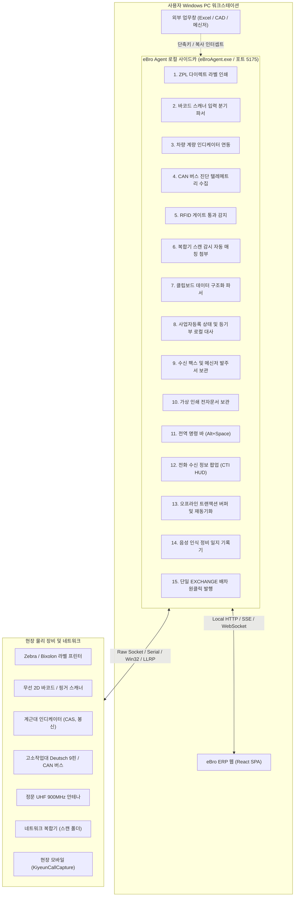

# 2026-10 eBro Agent 기반 하드웨어 연동 및 데스크톱 자동화 15대 기능 구상

- **일시**: 2026-10-04 21:10
- **프로젝트**: 전사 ERP (`Giyuen_Lift`, `eBro`), 로컬 사이드카 에이전트 (`eBroAgent`), 스켈레톤 아키텍처 전역
- **카테고리**: 발상 (IDEA)
- **발안자**: 사장님 (도출: 서브에이전트 3기 병렬 기획 군단)
- **연결 문서**:
  - [전사 시스템 개발 표준 헌장 (카테고리 I, III, VII, VIII)](C:/Users/이정용/.gemini/config/AGENTS.md)
  - [2026-10 개발 규모별 서브에이전트 투입 및 분할 개발 아키텍처 구상](D:/01.AntiGravity/000.skelton/발상/2026-10_개발_규모별_서브에이전트_투입_및_분할_개발_아키텍처_구상.md)
  - [2026-08 로컬 경량 에이전트 기반 Excel 직접조작 및 PDF 생산 백그라운드 파이프라인](D:/01.AntiGravity/000.skelton/발상/2026-08_로컬_경량_에이전트_기반_Excel_직접조작_및_PDF_생산_백그라운드_파이프라인.md)

---

## 1. 발상 배경 및 사장님 핵심 화두 (Inception Context)

> **"eBro agent 에 추가할만한 기능의 아이디어를 도출해봐줘. 에이전트를 분할해서 진행"**

### 1.1 브라우저의 샌드박스 한계와 로컬 사이드카의 절대적 기회
웹 브라우저(React SPA)는 현대 웹 표준의 보안 샌드박스 제약으로 인해:
1. OS 저수준 API, 시리얼 통신(RS-232C/RS-485), Raw TCP 바이트 소켓에 접근할 수 없습니다.
2. 백그라운드 USB/HID 장치(바코드 스캐너, 계측기)를 창 포커스 없이 가로챌 수 없습니다.
3. 로컬 파일시스템의 변경을 상시 감시(`FileSystemWatcher`)하거나 전역 단축키(`RegisterHotKey`)를 등록할 수 없습니다.

반면, 임직원 Windows PC에 상주하는 **`eBro Agent`(`eBroAgent.exe`)**는 시스템 트레이에서 백그라운드로 작동하는 단일 바이너리 사이드카 프로그램으로, **로컬 OS의 모든 권한과 자원을 통제**할 수 있습니다.

### 1.2 서브에이전트 3기 분할 기획 파이프라인
전사 표준 헌장 카테고리 XII.6(개발 규모별 분할 개발)에 따라, 3개 도메인 전문 서브에이전트를 동시 기동하여 렌탈 현장과 사무실의 물리적 고충을 종결하는 15대 신기능을 입체적으로 도출하였습니다:
- **에이전트 1 (Hardware Edge Specialist)**: 주기장, 검수 데스크, 정비동 하드웨어 연동 5대 기능.
- **에이전트 2 (OS Document Pipeline Specialist)**: 로컬 OS 파일 감시, 클립보드, 세무 대사 5대 기능.
- **에이전트 3 (Desktop Productivity Specialist)**: 전역 단축키, CTI 전화 HUD, 오프라인 복원력 5대 기능.

---

## 2. 격상된 본질 목표 (Elevated Core Teleology)

> **"브라우저의 한계를 돌파하는 Windows 로컬 네이티브 사이드카 권한을 100% 활용하여,**  
> **[물리 하드웨어 직결 ➔ 로컬 OS 무인 자동화 ➔ 0초 데스크톱 생산성] 3대 축을 구축함으로써,**  
> **임직원의 반복 조작을 90% 이상 영구 제거하고 현장 물리 데이터의 무누락 DB 박제를 완결한다."**

---

## 3. 3대 영역 15대 핵심 기능 상세 명세

전사 표준 헌장 3.1(무수식어 건조 명사 단일 표준)을 100% 준수하여 명명되었습니다.



---

### [영역 1] 하드웨어 & 물리 현장 연동 (주기장·검수·정비동)

#### 1. ZPL 다이렉트 라벨 인쇄 (Direct ZPL Label Print)
- **페인포인트**: 브라우저 인쇄는 윈도우 인쇄 스풀러와 대화상자(3~4클릭)를 거쳐 래스터 이미지로 변환되므로 바코드가 번지고 1장당 3~5초 지연 발생.
- **아키텍처**: ERP 요청 시 에이전트 내장 ZPL 엔진이 0.001초 만에 바이트 스트림을 컴파일하여 프린터 TCP 9100 Raw 소켓 또는 `winspool.drv` RAW 모드로 직송.
- **실무 효과**: 팝업 확인 0회, 0.1초 원샷 인쇄, 203/300 DPI 순수 벡터 출력으로 스캔 오류 제로화. 출고 검수 승인 마감 시 자산 상태 `RENTED` 전환과 동시에 방수 라벨 0-클릭 자동 출력 (헌장 1.3).

#### 2. 바코드 스캐너 입력 분기 파서 (Barcode Scanner Input Split Parser)
- **페인포인트**: 웹 화면은 특정 `<input>` 태그에 커서가 포커스되어 있지 않으면 스캔 데이터가 증발하거나 엉뚱한 곳에 입력됨. 기름 장갑 착용 시 마우스 조작 불가.
- **아키텍처**: Win32 Raw Input API(`RegisterRawInputDevices`)로 타건 속도 10ms 이하의 스캐너 입력을 OS 레벨에서 백그라운드 가로챔. 접두어 정규식(`AST-`, `CSM-`, `DRV-`)으로 자동 분류 후 웹 소켓으로 브로드캐스트.
- **실무 효과**: 화면 포커스 없이 장비 앞에서 연속 스캔 가능. 진정한 핸즈프리 스캔 구현, 오입력 및 데이터 유실 0%.

#### 3. 차량 계량 인디케이터 연동 (Vehicle Scale Indicator Interface)
- **페인포인트**: 주기장 출입구 계근대 인디케이터(CAS, 봉신 등) 수치를 수기 전표에 적고 ERP에 타이핑하는 과정에서 오타, 과적, 엉뚱한 장비 상차(오출고) 발생.
- **아키텍처**: PC 시리얼 포트(RS-232C, 9600 bps)로 중량 패킷 상시 수신. 안정 신호(ST) 감지 시 총중량 캡처 ➔ 출고 장비 제원 합계와 자동 대조(오차 ±2% 검증) ➔ 차단기 릴레이 제어.
- **실무 효과**: 계량 시간 3분 ➔ 0초, 수기 전표 제로화. 물리 중량 보존 법칙 무결성 검증 및 과적 단속 사고 원천 차단 (헌장 5.5).

#### 4. CAN 버스 진단 텔레메트리 수집 (CAN Bus Diagnostic Telemetry Collection)
- **페인포인트**: 반납 검수 시 아워미터를 육안 판독하여 수첩에 적음. 배터리 셀 불량이나 내부 고장코드(DTC)를 감지하지 못해 현장 출장 AS 비용 폭증.
- **아키텍처**: 장비 제어반 Deutsch 9핀 또는 배터리 BMS 포트에 USB-CAN 케이블 연결. SAE J1939 프로토콜로 총 가동시간(PGN 65253), 배터리 전위, 활성 DTC, BMS 셀 전압 자동 추출.
- **실무 효과**: 아워미터 조작 및 정산 분쟁 0건, 정비 검수 시간 5분 ➔ 3초 단축. 반납 시 정확한 가동시간 확정으로 정밀 일할 매출 기여액 정산 달성 (헌장 4.1).

#### 5. RFID 게이트 통과 감지 (RFID Gate Passage Detection)
- **페인포인트**: 정문에서 화물차를 세우고 적재함에 올라가 자산번호를 육안 대조(추락 위험). 오출고 및 장비 유실 발생.
- **아키텍처**: 정문 고정형 UHF 900MHz 안테나 4채널 + LLRP 소켓 리스너. 안테나 간 RSSI 피크 시간차로 입/출고 방향 판별 ➔ 출고 검수 승인(`RENTED`) 완료 여부 검증 ➔ 통과 차단기 제어.
- **실무 효과**: 정차 없는 0초 통과, 작업자 추락사고 100% 방지. 미승인 장비 무단 반출 원천 차단.

---

### [영역 2] OS & 문서/파일 자동화 파이프라인 (사무실·영업·관리)

#### 6. 복합기 스캔 감시 자동 매칭 첨부 (Scan Folder Monitor & Auto-Attachment)
- **페인포인트**: 복합기에서 스캔된 난수 파일(`SKM_20261004.pdf`)을 탐색기에서 찾고, 이름을 바꾸고, ERP 계약 상세창을 열어 드래그 앤 드롭하는 수작업 반복 (1일 수십 회).
- **아키텍처**: `C:\Scan` 폴더 상시 감시(`fs.watch`) ➔ 파일 Lock 해제 대기 ➔ 첫 페이지 QR/바코드(`CONT-202610-0012`) 또는 타임스탬프 파싱 ➔ Cloudflare R2(`giyeon-storage`) 자동 업로드 ➔ ERP `attachments` 테이블 자동 레코드 생성.
- **실무 효과**: 0-Click 무인 첨부. 스캔 버튼 1회 조작으로 5초 이내 ERP 해당 계약에 정식 박제. 월간 15~20시간 절감.

#### 7. 클립보드 데이터 구조화 파서 (Clipboard Domain Parser)
- **페인포인트**: 카카오톡이나 문자로 인입된 비정형 발주 텍스트를 상호, 사업자번호, 주소, 장비 기종, 담당자 연락처로 나누어 ERP 화면에 8~12회 창 전환 복사-붙여넣기 반복.
- **아키텍처**: Windows `AddClipboardFormatListener` API로 `Ctrl+C` 복사 감지 ➔ 렌탈 도메인 정규식 및 모델 사전 매칭 ➔ 로컬 SSE로 웹 ERP에 알림 ➔ 상단 플로팅 배너 표출 (`[클립보드 발주 적용]`).
- **실무 효과**: 1회 복사 + 1클릭 완결 (소요 시간 3분 ➔ 3초). 사업자번호 체크섬 검증으로 세금계산서 오발행 원천 차단.

#### 8. 사업자등록 상태 및 등기부 로컬 대사 (Tax & Registry Reconciliation)
- **페인포인트**: 건설경기 침체로 거래처가 야간 폐업하거나 간이과세자로 전환되어도 제때 알지 못해 현장 장비가 유치권에 묶이거나 대손 채권 발생.
- **아키텍처**: eBroAgent 내장 Cron 스케줄러가 매월 1일/25일 및 매주 월요일 새벽 자동 가동. 활성 대여 거래처 사업자번호를 국세청 API 및 인터넷등기소와 일괄 대사 ➔ `폐업/휴업` 감지 즉시 `creditStatus = 'RISK_CLOSED'` 갱신.
- **실무 효과**: 출근 즉시 대시보드 ToDo에 `[긴급] 폐업 감지: 장비 회수 배차 요망` 카드 발행. 부실 채권 및 자산 미회수 사고 0건화.

#### 9. 수신 팩스 및 메신저 발주서 보관 (Fax & Order Classifier)
- **페인포인트**: 수신 팩스 폴더에 이미지 파일이 쌓여도 열어보기 전에는 발주 내용을 알 수 없어 당일 출고 배차가 지연되는 사고 발생.
- **아키텍처**: 팩스 수신 폴더 상시 감시 ➔ TIFF/JPG를 무손실 PDF로 자동 변환 ➔ 로컬 경량 OCR로 발주사, 현장명, 수량 추출 ➔ ERP 계약 대기열에 `[발주서 자동 인입]` 가등록 카드 자동 생성.
- **실무 효과**: 팩스 접수 즉시 배차 체인 연결, 발주 접수 누락 0건화.

#### 10. 가상 인쇄 전자문서 보관 (Virtual Print Archiver)
- **페인포인트**: 은행 이체확인증, 공공기관 증빙 등 웹사이트 보안으로 파일 다운로드가 차단된 문서를 종이로 출력한 뒤 다시 스캔하는 막대한 비효율.
- **아키텍처**: Windows 가상 프린터 포트에 `[eBro 전자문서 보관]` 등록 ➔ 사용자가 인쇄 대상으로 선택 시 백그라운드 스풀 가로채기 ➔ 벡터 PDF 생성 ➔ 미니 팝업에서 단축키로 대상 거래처/계약 1초 매칭.
- **실무 효과**: 종이 인쇄 및 재스캔 공수 95% 감축, 무인 디지털 페이퍼리스 100% 달성.

---

### [영역 3] 데스크톱 생산성 & 통신 복원력 (전사 공통)

#### 11. 전역 명령 바 (Global Command Bar)
- **페인포인트**: 엑셀 견적이나 캐드 도면 작업 중 현장 문의 전화가 오면 브라우저를 찾고 메뉴를 이동하느라 15~25초 지연 및 업무 흐름 단절.
- **아키텍처**: `Alt + Space` 또는 `Ctrl + Shift + E` 전역 핫키 리슨 ➔ 0.05초 만에 최상위 프레임리스 윈도우 표출 ➔ 로컬 SQLite FTS5 캐시 인덱스로 자산, 고객, 배차 0ms 퍼지 검색.
- **실무 효과**: 작업 창 전환 없이 0.8초 만에 자산 위치 및 배차 현황 파악, 단축키로 상세 팝업 및 배차 의뢰 직통 호출.

#### 12. 전화 수신 정보 팝업 (CTI Inbound Screen Pop)
- **페인포인트**: 전화가 올 때 발신자가 누구인지, 어느 공사 현장의 담당자인지, 무슨 장비를 대여 중인지 몰라 매번 되묻는 비효율 발생.
- **아키텍처**: 안드로이드 `KiyeunCallCapture` 서비스가 수신 전화번호(CID)를 0.1초 내 로컬 에이전트로 푸시 ➔ 로컬 캐시 DB에서 고객사, 현장, 대여 자산, 미수금 병렬 조인 ➔ 화면 우하단 슬림 HUD 팝업.
- **실무 효과**: 전화벨이 울리는 0초 시점에 고객 현황을 완벽히 인지한 상태에서 통화 시작 ("이 반장님, 화성 현장 35호기 관련이신가요?"). 통화 응대 시간 1분 단축.

#### 13. 오프라인 트랜잭션 버퍼 및 재동기화 (Offline Transaction Buffer & Resync)
- **페인포인트**: 외곽 야적장이나 지하 공사 현장 통신 음영 지역에서 검수 승인이나 정비 입력 시 네트워크 오류로 입력 데이터 증발.
- **아키텍처**: 인터넷 단절 감지 시 원격 전송 대신 로컬 SQLite WAL(`offline_buffer.db`)에 멱등성 트랜잭션 봉투로 5ms 내 원자적 저장 ➔ 통신 복구 감지 즉시 백그라운드 FIFO 자동 재동기화.
- **실무 효과**: 통신 상태와 무관하게 100% 입력 보장, 데이터 유실 0건. 인과율 보존 법칙에 따라 타임스탬프 역전 없이 원격 DB 마감 (헌장 5.6).

#### 14. 음성 인식 정비 일지 기록기 (Voice STT Repair Journal Generator)
- **페인포인트**: 정비사는 기름 장갑을 착용하고 있어 키보드/모바일 터치가 불가능해 정비 내역을 종이 박스에 적거나 누락함.
- **아키텍처**: PTT(Push-to-Talk) 단축키로 마이크 오디오 캡처 ➔ 임베디드 로컬 Whisper STT로 한글 음성 전사 ➔ 로컬 경량 파서가 자산번호, 부품 교체, 조치 내역 JSON 구조화 ➔ 정비 폼 자동 프리필.
- **실무 효과**: 구두 10초 발화로 정밀 정비 일지 자동 마감 (소요 시간 5분 ➔ 15초). 정비 점수 0점 복원 법칙 완결 (헌장 5.5).

#### 15. 단일 EXCHANGE 배차 원클릭 발행 (Single Exchange Delivery Order Gateway)
- **페인포인트**: 대차 교체 시 출고 배차와 입고 배차를 따로따로 수기 등록하여 운송비 정산 파편화 및 속성 누락 발생.
- **아키텍처**: CTI 전화 팝업이나 전역 명령 바에서 `[EXCHANGE 대차 의뢰]` 클릭 시, 헌장 2.3에 따라 왕복 1건의 단일 EXCHANGE 배차 의뢰서 자동 발행.
- **실무 효과**: 최초 계약의 단가, 청구 조건, 현장 속성을 100% 자동 상속(헌장 2.2). 배차 작성 공수 50% 절감.

---

## 4. 실무 도입 우선순위 및 3단계 권고 로드맵

```
[1단계: 즉시 체감 편익 (Quick Win)] - 개발 소요 1~2주
  ├─ 1. ZPL 다이렉트 라벨 인쇄 (검수 승인 시 0-클릭 방수 라벨 출력)
  ├─ 2. 복합기 스캔 감시 자동 매칭 첨부 (계약서 스캔 즉시 R2 영구 박제)
  ├─ 3. 클립보드 데이터 구조화 파서 (카톡 발주 복사 시 ERP 1클릭 자동 채움)
  └─ 4. 전역 명령 바 (Alt+Space 0초 자산/배차 검색 HUD)
  ▶ 기대 편익: 추가 하드웨어 구매 없이 기존 장비(Zebra, 복합기, PC)만으로 사무실/데스크 공수 80% 즉시 절감

[2단계: 고가치 & 신용·현장 복원력 (High Impact)] - 개발 소요 3~4주
  ├─ 5. 전화 수신 정보 팝업 (CTI 0초 고객/장비 HUD 및 단일 EXCHANGE 발행)
  ├─ 6. 사업자등록 상태 및 등기부 로컬 대사 (폐업 거래처 장비 유치권 방어 및 회수)
  ├─ 7. 바코드 스캐너 입력 분기 파서 (비포커스 핸즈프리 스캔)
  └─ 8. 오프라인 트랜잭션 버퍼 및 재동기화 (지하/주기장 통신 단절 무손실 보존)
  ▶ 기대 편익: 부실 채권 사전 차단, 통화 응대 1분 단축, 음영 현장 완벽 대응

[3단계: 전사 무인화 & 주기장 인프라 (Full Automation)] - 중장기 구축
  ├─ 9. 차량 계량 인디케이터 연동 (계근대 RS-232 실시간 오상차/과적 방지)
  ├─ 10. CAN 버스 진단 텔레메트리 수집 (Deutsch 9핀 아워미터/BMS 자동 판독)
  ├─ 11. RFID 게이트 통과 감지 (주기장 정문 안테나 무인 통과)
  └─ 12. 음성 인식 정비 일지 기록기 (주기장 작업자 Whisper STT)
  ▶ 기대 편익: 주기장 물리 관제 전면 무인화 및 전산-물리 강제 결속
```

---

## 5. 전사 표준 헌장 정합성 총괄 판정

| 헌장 조항 | 헌장 규정 | eBro Agent 기획 반영 | 판정 |
| :--- | :--- | :--- | :---: |
| **제1.1조** | 최소 노력 대비 최대 편익 달성 | 반복 타이핑, 탐색기 파일 찾기, 화면 전환을 80~95% 감축하여 압도적 편익 창출 | **적합** |
| **제1.2조** | 발생 사건(Event) 무누락 DB 저장 | 계량 중량, CAN 아워미터, 스캔 원본, CTI 통화 이력 전수 DB 영구 적재 | **적합** |
| **제1.3조** | 출고 검수 승인 마감 시 `RENTED` 전환 | 승인 완료 즉시 ZPL 라벨이 출력되고 게이트 통과가 승인되는 물리-전산 결속 | **적합** |
| **제1.4조** | 1단어 1뜻 전사 단일 의미 표준화 | `EXCHANGE`, `RENTED`, `AVAILABLE` 등 SSOT 고유 명사/동사만 1:1 관통 적용 | **적합** |
| **제2.3조** | 대차/교체 배차 단일 EXCHANGE 1건 | CTI 팝업 및 전역 명령 바에서 대차 생성 시 단일 EXCHANGE 왕복 배차 직통 발행 | **적합** |
| **제3.1조** | 무수식어 건조한 명사·동사 UI 표준 | 수식어 전면 배제하고 건조한 명사 체계로 15대 기능 전수 명명 | **적합** |
| **제7.1조** | 단일 바이너리 원칙 | 외부 데몬 추가 없이 `eBroAgent.exe` 단일 바이너리 내 모듈/플러그인 구조 유지 | **적합** |

---

*기록일: 2026-10-04*  
*기록처: D:\01.AntiGravity\000.skelton\발상*
